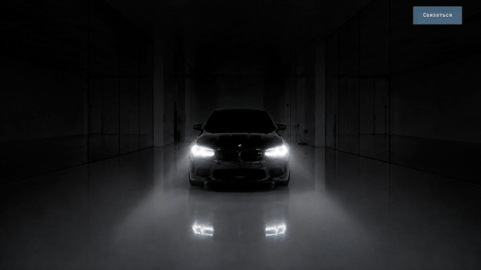

# AUTOSERVICE/01

**An animation-heavy portfolio demo showing how a cinematic interface can remain responsive, accessible, testable, and maintainable.**

[View the live site](https://autoservice-voronezh.vercel.app) · [Read the architecture](./ARCHITECTURE.md)

[](https://autoservice-voronezh.vercel.app)

## Problem

The goal was not simply to style an auto-service landing page. It was to build a motion-led experience that remains coherent outside an ideal screen recording: while media loads, after transient request failures, during forward and reverse scrolling, at restored scroll positions, on desktop and mobile, and when reduced motion is enabled.

## My Role

I was responsible for the frontend architecture and implementation: component and content structure, scroll-to-video synchronization, responsive interaction models, accessibility states, media failure handling, performance guardrails, and regression tests.

## Technical Decisions

- **Responsive behavior, not just responsive layout.** Desktop and mobile use interaction models designed for their available space: a spatial pricing sequence on desktop and a compact 3D card transition on mobile.
- **Resilient media handoffs.** A poster remains visible until the first decoded video frame is ready. Transient video failures trigger a retry before the interface switches to a static fallback.
- **Feature-oriented architecture.** Hero, pricing, promotions, contact, and drive-away logic are isolated into components, hooks, models, styles, and typed public APIs. Demo content remains separate from presentation.
- **Deferred lower sections.** Brands, promotions, and the closing sequence are split into separate chunks and mounted only when they approach the viewport.
- **Measured performance.** An optimization pass reduced initial JavaScript from about 891 kB to 645.6 kB raw and from 279.9 kB to 203.1 kB gzip. CI rejects builds above 700 kB raw or 225 kB gzip.
- **Maintainable component boundaries.** The project contains 49 React component files, with none exceeding 199 lines.

## Motion Architecture

The page uses three coordinated motion systems rather than one continuous timeline.

1. **Exterior-to-engine hero.** The hero moves through explicit `loading`, `intro`, `scrub`, and `fallback` phases. Wheel and touch velocity can accelerate the intro up to 4×, while forward keyboard input can complete it immediately. After the intro and copy hold finish, GSAP maps scroll progress to a reversible video scrub without crossing back into the intro segment.

2. **Device-specific pricing.** Desktop maps scroll progress across a spatial sequence of service cards. Mobile uses a compact 3D flip whose rotation is frame-rate independent and capped to avoid visible jumps. Both versions support keyboard navigation.

3. **Drive-away finale.** A separate scroll timeline synchronizes the closing video, opposing review marquees, typed contact details, and the map transition. Video seeks are coalesced and mapped to stable 24 fps frames so reverse scrolling remains predictable.

## Accessibility

- `prefers-reduced-motion` replaces motion-heavy sequences with deliberate static states and disables smooth scrolling.
- Pricing is exposed as a named, focusable carousel region with Arrow, Page, Home, and End key controls.
- Moving reviews include a pause control; reduced-motion users receive a static review list.
- Decorative media is hidden from the accessibility tree, while animated text keeps a complete screen-reader version.
- Contact flows use semantic dialog and drawer primitives, move focus to the first action, and restore focus to the trigger after closing.
- Visible focus states, meaningful labels, and alternative text are included for interactive content.

## Testing

The 18 automated tests cover:

- hero loading, first-frame handoffs, retries, and restored scroll positions;
- intro-to-scrub state transitions and reverse-scrub boundaries;
- drive-away video frame mapping and reverse seeking;
- mobile price-card continuity and frame-rate-independent motion.

Every push and pull request runs the same verification sequence on Node.js 22:

```text
npm ci → typecheck → lint → tests → production build → bundle budget
```

Run the complete suite locally with:

```bash
npm run check
```

## Run Locally

Requires Node.js 22 and npm.

```bash
npm ci
npm run dev
```

Create and preview a production build:

```bash
npm run build
npm run preview
```

## Stack

React 19 · TypeScript · Vite · GSAP · Motion · Lenis · ScrollyVideo · Swiper · Tailwind CSS

> **Demo content:** This is a fictional portfolio project. The business name, address, phone number, reviews, promotions, and other commercial content do not represent a real service center.
